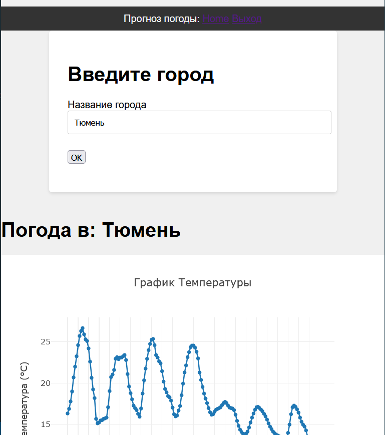

# weather
Прогноз погоды

...пользователь вводит название города, и получает прогноз погоды в этом городе на ближайшее время.

 - *Вывод данных (прогноза погоды) должен быть в удобно читаемом формате. 

 - Веб фреймворк можно использовать любой.

 - api для погоды:* https://open-meteo.com/ *(можно использовать какое-нибудь другое, если вам удобнее)*

Использован фреймворк Flask, так как приложение небольшое
Сделана главная страница с выплывающей формой регистрации и постоянной формой ввода города. По наименованию города ищутся координаты (необходим ключ апи для opencagedata.com).

Для работы необходимо клонировать репозиторий, создать в корневой папке файл .env:

SECRET_KEY=a-really-long-and-unique-key-that-nobody-knows
GEOLOC_KEY=some-key-for-opencagedata

Подставить свои ключи. Установить зависимости и запустить flask.

Создан ендпойнт /api/cities по которому выпадает статистика запросов по городам. Работает с токеном, который нужно получить через basic auth по /api/tokens